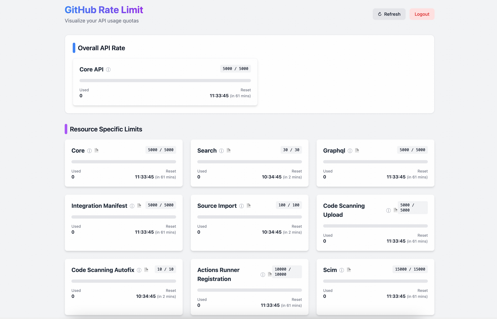

# GitHub Rate Limit Dashboard

A modern, visual dashboard to monitor your GitHub API rate limits with interactive tooltips and direct documentation links.



## Features

- **Visual Dashboard:** View Core, Search, GraphQL, and other API limits as cards.
- **Progress Tracking:** Color-coded progress bars show your usage status (Green/Yellow/Red).
- **Time Conversion:** Automatically converts Unix timestamps to local readable time.
- **Secure:** Your Personal Access Token (PAT) is stored only in your browser's local storage.
- **Interactive Tooltips:** Hover over resource names to see detailed descriptions of each API type.
- **Documentation Links:** Click the document icon (📄) next to each resource to view GitHub's official documentation.


## Tech Stack

- React 18
- TypeScript
- Vite
- Tailwind CSS

## Getting Started

1. **Clone the repository:**
   ```bash
   git clone <repository-url>
   cd github-rate-dashboard
   ```

2. **Install dependencies:**
   ```bash
   npm install
   ```

3. **Start the development server:**
   ```bash
   npm run dev
   ```

4. **Open in browser:**
   Open the URL shown in the terminal (usually `http://localhost:5173`).

5. **Enter your Token:**
   Paste your GitHub Personal Access Token to see your limits. (you can get through `https://github.com/settings/tokens`)
   Core: ` curl -i -H "Authorization: token your_token_here" https://api.github.com/rate_limit`

## Building for Production

```bash
npm run build
```

The output will be in the `dist` directory.

## Usage

- **Token Input:** Enter your GitHub PAT securely. It's stored locally in your browser.
- **Refresh Data:** Click the refresh button to update your rate limits.
- **View Details:** Hover over resource names for tooltips, or click documentation links for more info.
- **Logout:** Clear your token and data.

## Security Note

Your GitHub token is never sent to any external servers. All processing happens client-side in your browser.

## Contributing

Feel free to open issues or submit pull requests for improvements.

## Adding Screenshots

To add screenshots to the documentation:

1. Take screenshots of the dashboard interface
2. Save them in the `screenshots/` directory as `dashboard.png` and `tooltip.png`
3. The images will automatically display in the README files

Example: Open the app, capture the main dashboard view, and hover over a resource to capture the tooltip.
